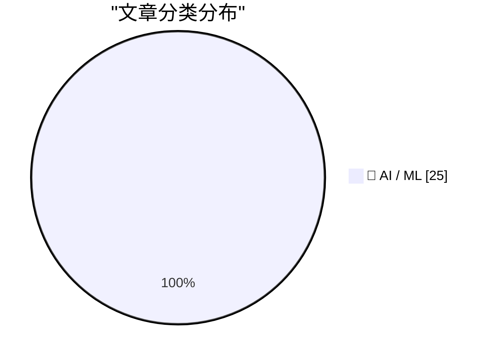
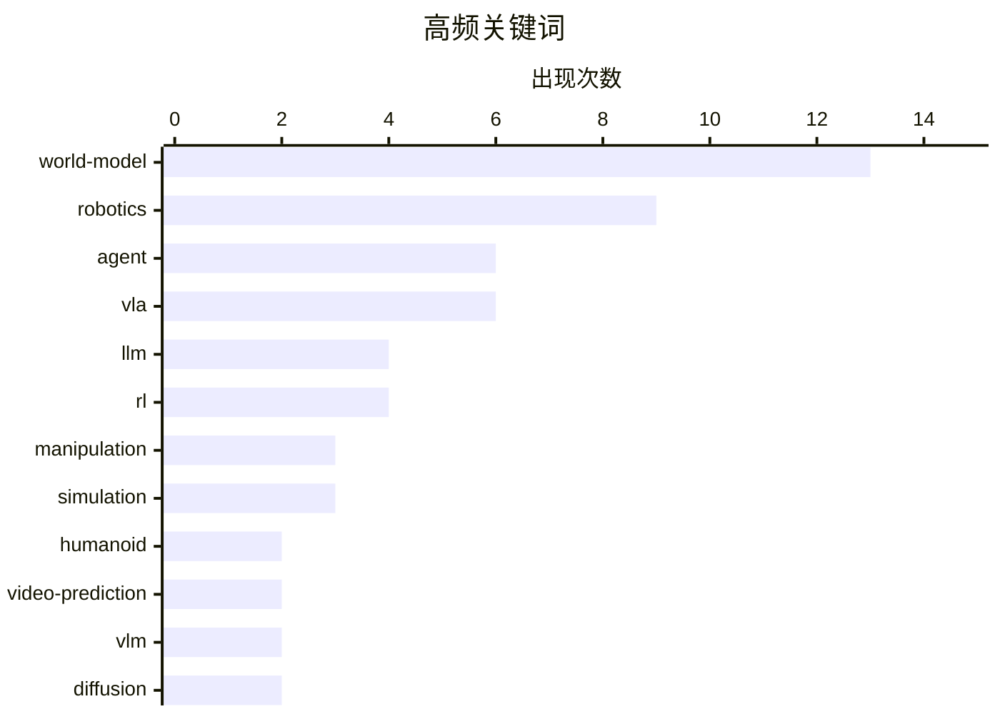

# 📰 AI 博客每日精选 — 2026-03-10

> 来自 Karpathy 推荐的 110 个顶级技术博客，AI 精选 Top 25

## 📝 今日看点

今日技术圈聚焦于具身智能的深度突破，视觉-语言-动作（VLA）模型与世界模型的结合成为主流，旨在解决人形机器人在复杂物理环境中的交互与规划难题。研究重点不仅在于通过架构创新提升模型的空间推理能力与执行效率，还致力于构建可验证的安全策略与新型基准测试，以强化智能体的鲁棒性与泛化边界。这标志着AI正加速向更符合物理规律且可控的实体智能演进。

---

## ⚠️ Feeds状态

成功获取 107/110 个feeds，2 个失败

### ❓ 其他错误 (2)

- **dwarkesh.com**: HTTP 502 - Bad Gateway
- **paulgraham.com**: Unable to connect. Is the computer able to access the url?

---

## 🏆 今日必读

🥇 **用于人形机器人接触规划的以自我为中心视觉世界模型**

[Ego-Vision World Model for Humanoid Contact Planning](https://arxiv.org/abs/2510.11682) — ArXiv CS.SY (Control) · 11 小时前 · 🤖 AI / ML

> 人形机器人在非结构化环境中需要利用物理接触而非单纯避障，但传统优化规划器难以处理接触复杂性，而在线强化学习样本效率低且多任务能力有限。该研究提出了一种结合学习型世界模型与基于采样的模型预测控制（MPC）的框架，利用以自我为中心的视觉数据进行训练。该方法通过世界模型预测未来状态，并利用MPC进行接触序列的优化采样，从而解决复杂的接触动力学问题。实验表明该框架能有效提升机器人在复杂环境中的自主操作能力。

💡 **为什么值得读**: 将世界模型与MPC结合，解决了人形机器人接触规划这一长期难题，为复杂物理交互提供了新思路。

🏷️ world-model, humanoid, vision, contact-planning

🥈 **遍历即策略：作为安全、鲁棒和高效智能体的外部化、可验证策略的日志蒸馏门控行为树**

[Traversal-as-Policy: Log-Distilled Gated Behavior Trees as Externalized, Verifiable Policies for Safe, Robust, and Efficient Agents](https://arxiv.org/abs/2603.05517) — ArXiv CS.AI · 11 小时前 · 🤖 AI / ML

> 自主大语言模型智能体常因长期策略隐含在模型权重中且安全性滞后而失败，缺乏可验证性和鲁棒性。该研究提出了“遍历即策略”方法，将沙盒执行日志蒸馏为单个可执行的门控行为树（GBT），并将树遍历而非无约束生成为控制策略。每个节点编码了挖掘出的状态条件动作宏，使策略在任务覆盖范围内可执行且显式化。这种方法将策略逻辑外部化，实现了安全、鲁棒且高效的智能体行为。

💡 **为什么值得读**: 通过将LLM策略蒸馏为可验证的行为树，解决了智能体安全性和可解释性的痛点，具有很强的工程应用价值。

🏷️ agent, safety, robust-control, verification

🥉 **通过免训练注意力校准恢复VLA模型的语言对齐**

[Restoring Linguistic Grounding in VLA Models via Train-Free Attention Recalibration](https://arxiv.org/abs/2603.06001) — ArXiv CS.AI · 11 小时前 · 🤖 AI / ML

> 视觉-语言-动作（VLA）模型在处理分布外（OOD）指令时存在关键缺陷，即当语言指令与视觉场景冲突时，模型仍会继续执行视觉上看似合理的动作而忽略指令。该研究揭示了这一故障模式，并提出了一种无需重新训练的注意力校准方法。该方法通过在推理过程中调整注意力权重，强制模型重新关注语言指令，从而恢复语言对齐能力。实验证明该方法能有效提升VLA模型在OOD场景下的可靠性和安全性。

💡 **为什么值得读**: 指出了VLA模型在OOD指令下的致命盲点，并提供了一种无需重新训练即可修复的实用方法，对提升机器人安全至关重要。

🏷️ VLA, robotics, manipulation, OOD

---

## 📊 数据概览

| 扫描源 | 抓取文章 | 时间范围 | 精选 |
|:---:|:---:|:---:|:---:|
| 107/110 | 5613 篇 → 2138 篇 | 48h | **25 篇** |

### 分类分布



### 高频关键词



<details>
<summary>📈 纯文本关键词图（终端友好）</summary>

```
world-model      │ ████████████████████ 13
robotics         │ ██████████████░░░░░░ 9
agent            │ █████████░░░░░░░░░░░ 6
vla              │ █████████░░░░░░░░░░░ 6
llm              │ ██████░░░░░░░░░░░░░░ 4
rl               │ ██████░░░░░░░░░░░░░░ 4
manipulation     │ █████░░░░░░░░░░░░░░░ 3
simulation       │ █████░░░░░░░░░░░░░░░ 3
humanoid         │ ███░░░░░░░░░░░░░░░░░ 2
video-prediction │ ███░░░░░░░░░░░░░░░░░ 2
```

</details>

### 🏷️ 话题标签

**world-model**(13) · **robotics**(9) · **agent**(6) · vla(6) · llm(4) · rl(4) · manipulation(3) · simulation(3) · humanoid(2) · video-prediction(2) · vlm(2) · diffusion(2) · memory(2) · video-generation(2) · rag(2) · vision(1) · contact-planning(1) · safety(1) · robust-control(1) · verification(1)

---

## 🤖 AI / ML

### 1. 用于人形机器人接触规划的以自我为中心视觉世界模型

[Ego-Vision World Model for Humanoid Contact Planning](https://arxiv.org/abs/2510.11682) — **ArXiv CS.SY (Control)** · 11 小时前 · ⭐ 30/30

> 人形机器人在非结构化环境中需要利用物理接触而非单纯避障，但传统优化规划器难以处理接触复杂性，而在线强化学习样本效率低且多任务能力有限。该研究提出了一种结合学习型世界模型与基于采样的模型预测控制（MPC）的框架，利用以自我为中心的视觉数据进行训练。该方法通过世界模型预测未来状态，并利用MPC进行接触序列的优化采样，从而解决复杂的接触动力学问题。实验表明该框架能有效提升机器人在复杂环境中的自主操作能力。

🏷️ world-model, humanoid, vision, contact-planning

---

### 2. 遍历即策略：作为安全、鲁棒和高效智能体的外部化、可验证策略的日志蒸馏门控行为树

[Traversal-as-Policy: Log-Distilled Gated Behavior Trees as Externalized, Verifiable Policies for Safe, Robust, and Efficient Agents](https://arxiv.org/abs/2603.05517) — **ArXiv CS.AI** · 11 小时前 · ⭐ 29/30

> 自主大语言模型智能体常因长期策略隐含在模型权重中且安全性滞后而失败，缺乏可验证性和鲁棒性。该研究提出了“遍历即策略”方法，将沙盒执行日志蒸馏为单个可执行的门控行为树（GBT），并将树遍历而非无约束生成为控制策略。每个节点编码了挖掘出的状态条件动作宏，使策略在任务覆盖范围内可执行且显式化。这种方法将策略逻辑外部化，实现了安全、鲁棒且高效的智能体行为。

🏷️ agent, safety, robust-control, verification

---

### 3. 通过免训练注意力校准恢复VLA模型的语言对齐

[Restoring Linguistic Grounding in VLA Models via Train-Free Attention Recalibration](https://arxiv.org/abs/2603.06001) — **ArXiv CS.AI** · 11 小时前 · ⭐ 29/30

> 视觉-语言-动作（VLA）模型在处理分布外（OOD）指令时存在关键缺陷，即当语言指令与视觉场景冲突时，模型仍会继续执行视觉上看似合理的动作而忽略指令。该研究揭示了这一故障模式，并提出了一种无需重新训练的注意力校准方法。该方法通过在推理过程中调整注意力权重，强制模型重新关注语言指令，从而恢复语言对齐能力。实验证明该方法能有效提升VLA模型在OOD场景下的可靠性和安全性。

🏷️ VLA, robotics, manipulation, OOD

---

### 4. AtomVLA：通过预测性潜在世界模型实现可扩展的机器人操作后训练

[AtomVLA: Scalable Post-Training for Robotic Manipulation via Predictive Latent World Models](https://arxiv.org/abs/2603.08519) — **ArXiv CS.RO (Robotics)** · 11 小时前 · ⭐ 29/30

> 现有的视觉-语言-动作（VLA）模型在监督微调中主要依赖粗粒度的高级任务指令，导致缺乏明确的中间步骤，难以执行复杂的多步操作。该研究提出了AtomVLA，利用预测性潜在世界模型进行可扩展的后训练，以填补指令对齐的差距。该方法通过世界模型预测中间状态，增强了模型对指令细节的理解和执行能力。结果表明，AtomVLA显著提升了VLA模型在复杂机器人操作任务中的表现。

🏷️ VLA, world-model, manipulation, post-training

---

### 5. 用于机器人策略训练和评估的交互式世界模拟器

[Interactive World Simulator for Robot Policy Training and Evaluation](https://arxiv.org/abs/2603.08546) — **ArXiv CS.RO (Robotics)** · 11 小时前 · ⭐ 29/30

> 现有的动作条件视频预测模型（世界模型）通常速度较慢，且难以捕捉长视野下的物理一致性交互，限制了其在机器人策略训练和评估中的实用性。该研究提出了交互式世界模拟器，这是一个从中等规模机器人交互数据集构建交互式世界模型的框架。该框架通过交互式生成机制，解决了长视野物理一致性问题，同时保证了生成速度。这使得在模拟环境中高效地训练和评估机器人策略成为可能。

🏷️ world-model, simulation, video-prediction, robotics

---

### 6. MetaWorld-X：通过VLM编排专家实现人形机器人移动操作的分层世界建模

[MetaWorld-X: Hierarchical World Modeling via VLM-Orchestrated Experts for Humanoid Loco-Manipulation](https://arxiv.org/abs/2603.08572) — **ArXiv CS.RO (Robotics)** · 11 小时前 · ⭐ 29/30

> 现有的强化学习方法常依赖单一策略来获取多技能，导致高自由度人形机器人在移动操作中出现跨技能梯度干扰和运动模式冲突。该研究提出了MetaWorld-X，一种通过视觉语言模型（VLM）编排专家的分层世界建模框架。VLM负责协调不同的专家模块，分别处理特定的子任务，从而避免策略间的冲突。该方法实现了自然、稳定且具有组合泛化能力的全身控制，显著提升了人形机器人的操作能力。

🏷️ world-model, humanoid, VLM, loco-manipulation

---

### 7. RetoVLA：在视觉-语言-动作模型中复用寄存器令牌进行空间推理

[RetoVLA: Reusing Register Tokens for Spatial Reasoning in Vision-Language-Action Models](https://arxiv.org/abs/2509.21243) — **ArXiv CS.RO (Robotics)** · 11 小时前 · ⭐ 29/30

> 视觉-语言-动作（VLA）模型虽然性能强大，但其高昂的内存和计算成本限制了实时部署，且现有的模型压缩技术往往牺牲了3D空间推理能力。该研究提出了RetoVLA架构，旨在轻量级模型中保持空间感知能力。通过复用寄存器令牌进行空间推理，RetoVLA在减少参数和计算量的同时，保留了关键的场景布局理解能力。实验表明，该方法在保持高性能的同时显著降低了部署门槛。

🏷️ VLA, multimodal, efficiency, robotics

---

### 8. SR-TTT：感知惊奇的残差测试时训练

[SR-TTT: Surprisal-Aware Residual Test-Time Training](https://arxiv.org/abs/2603.06642) — **ArXiv CS.LG (ML)** · 11 小时前 · ⭐ 29/30

> 测试时训练（TTT）语言模型通过快速权重替代KV-cache实现了O(1)内存 footprint，但在“大海捞针”等精确回忆任务上会因过度压缩上下文而失败。该研究提出了SR-TTT，一种感知惊奇的残差测试时训练方法。该方法通过计算惊奇度来决定何时保留原始上下文信息，并引入残差连接以防止信息丢失。SR-TTT成功结合了TTT的长上下文优势与标准注意力的精确回忆能力。

🏷️ TTT, LLM, context-window, test-time-training

---

### 9. $OneMillion-Bench：语言智能体距离人类专家还有多远？

[\$OneMillion-Bench: How Far are Language Agents from Human Experts?](https://arxiv.org/abs/2603.07980) — **ArXiv CS.LG (ML)** · 11 小时前 · ⭐ 29/30

> 现有的基准测试多局限于结构化或考试风格的任务，无法满足评估现实世界中具备多步推理和工具使用能力的语言智能体的需求。该研究推出了$OneMillion-Bench，一个包含400个专家策划任务的基准测试，涵盖法律、金融、工业、医疗和自然科学领域。该基准旨在模拟真实的专业工作环境，全面评估智能体的长周期任务处理能力。结果揭示了当前语言智能体与人类专家在实际应用中的显著差距。

🏷️ agent, benchmark, LLM, evaluation

---

### 10. 论多模态大语言模型在空间智能方面的泛化能力

[On the Generalization Capacities of MLLMs for Spatial Intelligence](https://arxiv.org/abs/2603.06704) — **ArXiv CS.LG (ML)** · 11 小时前 · ⭐ 29/30

> 直接处理RGB输入的多模态大语言模型（MLLMs）在3D定位和导航等任务上显示出潜力，但其在跨相机泛化方面存在根本性缺陷。该研究指出，忽略相机参数会导致物体的物理属性与相机视角纠缠，造成无法解决的歧义。实验证明，这导致MLLMs过度拟合特定视角，无法在新的相机设置下进行有效的空间推理。结论认为，真正的空间智能必须考虑相机参数，仅依赖RGB输入的方法存在局限性。

🏷️ MLLM, navigation, spatial-intelligence, 3D-localization

---

### 11. DreamSAC：通过对称性探索学习哈密顿世界模型

[DreamSAC: Learning Hamiltonian World Models via Symmetry Exploration](https://arxiv.org/abs/2603.07545) — **ArXiv CS.LG (ML)** · 11 小时前 · ⭐ 29/30

> 学习型世界模型在插值泛化上表现出色，但在针对新物理特性的外推泛化上往往失败，因为它们学习的是统计相关性而非底层的生成规则。文章提出学习物理不变性和守恒定律是实现稳健外推的关键，并引入了“对称性探索”机制。该方法通过发现环境中的对称性来构建遵循哈密顿动力学的世界模型。实验表明，DreamSAC 能够更好地捕捉物理规律，显著提升了模型在未见过的物理环境中的泛化能力。这一方法为解决世界模型物理一致性差的问题提供了新的数学基础。

🏷️ world-model, Hamiltonian, RL, symmetry

---

### 12. 用于在线强化学习的演进扩散与流匹配策略

[Evolving Diffusion and Flow Matching Policies for Online Reinforcement Learning](https://arxiv.org/abs/2512.02581) — **ArXiv CS.LG (ML)** · 11 小时前 · ⭐ 29/30

> 扩散和流匹配策略能够提供富有表现力和多模态的动作建模，但在在线强化学习中经常不稳定，这是由于难以处理的似然度和通过长采样链传播的梯度造成的。相比之下，高斯参数化虽然易于优化，却缺乏复杂控制所需的表现力，导致优化稳定性与表达能力之间存在持续的张力。文章提出了一种演进策略，旨在解决这一两难问题，通过动态调整模型参数来平衡稳定性和表达能力。该方法试图在不牺牲多模态表达能力的前提下，提高在线学习的稳定性。实验结果显示，该方法在保持高性能动作生成的同时，显著提升了训练过程的收敛性和鲁棒性。

🏷️ diffusion, RL, robotics, flow-matching

---

### 13. MEM：视觉语言动作模型的多尺度具身记忆

[MEM: Multi-Scale Embodied Memory for Vision Language Action Models](https://arxiv.org/abs/2603.03596) — **ArXiv CS.LG (ML)** · 11 小时前 · ⭐ 29/30

> 传统的端到端机器人学习通常将过去的观察序列直接输入策略，但在复杂的多阶段现实任务中，机器人需要表示不同粒度的过去事件。文章指出记忆机制应涵盖从捕捉抽象语义概念的长期记忆（如记住烹饪进度）到关注即时细节的短期记忆。为此，研究者提出了 MEM（多尺度具身记忆）框架，以适应不同时间尺度的信息存储与检索。该架构能够更有效地处理长视程任务中的状态依赖问题。通过在具身智能任务中的验证，MEM 显著提升了机器人在复杂环境下的任务执行成功率。

🏷️ VLA, embodied-ai, robotics, memory

---

### 14. LiveWorld：在生成视频世界模型中模拟视野外的动态变化

[LiveWorld: Simulating Out-of-Sight Dynamics in Generative Video World Models](https://arxiv.org/abs/2603.07145) — **ArXiv CS.CV (Vision)** · 11 小时前 · ⭐ 29/30

> 现有的生成视频世界模型虽然能模拟视觉环境的演变，但隐含假设世界仅在观察者的视野内进化，导致离开视野的物体状态被“冻结”，再次访问时无法反映期间发生的事件。为了解决这一局限，文章提出了 LiveWorld 框架，旨在模拟视野外的动态变化。该模型能够推理和生成观察者未直接看到的区域的状态更新，从而保证场景的全局一致性。实验证明，LiveWorld 在交互式场景探索中能提供更真实的物理模拟。这一突破对于构建可信的沉浸式环境至关重要。

🏷️ world-model, generative-video, simulation

---

### 15. DreamSAC：通过对称性探索学习哈密顿世界模型

[DreamSAC: Learning Hamiltonian World Models via Symmetry Exploration](https://arxiv.org/abs/2603.07545) — **ArXiv CS.CV (Vision)** · 11 小时前 · ⭐ 29/30

> 学习型世界模型擅长插值泛化，但在针对新物理特性的外推泛化上存在缺陷，主要归因于其学习统计相关性而非物理不变性和守恒定律等底层生成规则。文章提出学习这些不变性是实现稳健外推的关键，并引入了“对称性探索”机制。该方法通过探索环境对称性来构建遵循哈密顿动力学的世界模型，从而更好地捕捉物理规律。实验结果表明，DreamSAC 在未见过的物理环境中显著提升了泛化性能。这为计算机视觉和机器人学中的世界模型构建提供了新的物理约束视角。

🏷️ world-model, RL, physics

---

### 16. SAMoE-VLA：面向自动驾驶的场景自适应混合专家视觉语言动作模型

[SAMoE-VLA: A Scene Adaptive Mixture-of-Experts Vision-Language-Action Model for Autonomous Driving](https://arxiv.org/abs/2603.08113) — **ArXiv CS.CV (Vision)** · 11 小时前 · ⭐ 29/30

> 视觉语言动作模型在自动驾驶领域展现出潜力，但经验分析表明，直接将继承自大语言模型的 Token 级混合专家机制应用于 VLA 模型，会导致性能不稳定和安全性下降。文章指出现有的 MoE 机制与自动驾驶场景的需求存在不匹配，并提出了 SAMoE-VLA 框架。该模型采用场景自适应的专家选择策略，旨在平衡模型的表达能力与推理稳定性。实验结果显示，SAMoE-VLA 在保证计算效率的同时，显著提升了自动驾驶决策的安全性和鲁棒性。

🏷️ VLA, autonomous-driving, MoE, robotics

---

### 17. ΔVLA：通过世界知识变化先验引导的视觉语言动作模型

[$\Delta$VLA: Prior-Guided Vision-Language-Action Models via World Knowledge Variation](https://arxiv.org/abs/2603.08361) — **ArXiv CS.CV (Vision)** · 11 小时前 · ⭐ 29/30

> 现有的视觉语言动作模型通常采用预测范式，通过建模未来的视觉状态或世界知识来引导动作生成，但这往往侧重于预测结果而非推理变化过程。文章强调对底层变化过程的推理对于确定如何执行动作至关重要，并提出了 ΔVLA 模型。该模型利用世界知识的变化作为先验引导，专注于推理状态之间的转换过程。这种方法弥补了传统 VLA 模型在动态过程理解上的不足。实验表明，ΔVLA 在复杂的机器人操作任务中表现出更强的推理能力和操作精度。

🏷️ VLA, robotics, manipulation, world-model

---

### 18. SPIRAL：基于反思规划智能体的自改进动作世界模型闭环框架

[SPIRAL: A Closed-Loop Framework for Self-Improving Action World Models via Reflective Planning Agents](https://arxiv.org/abs/2603.08403) — **ArXiv CS.CV (Vision)** · 11 小时前 · ⭐ 29/30

> 现有的一次性视频生成模型采用开环方式，常导致动作执行不完整、语义基础薄弱和时间漂移问题。文章提出了 SPIRAL，这是一个自改进的规划和迭代反思动作世界建模闭环框架。SPIRAL 将动作世界模型构建为“思考-行动-反思”的过程，能够根据高级语义动作生成可控的长视程视频。该框架通过反思机制不断修正生成的视频内容，确保动作序列与语义意图的一致性。实验证明，SPIRAL 在长视频生成的连贯性和语义准确性上优于现有开环方法。

🏷️ world-model, agent, self-improving, video-generation

---

### 19. 用于机器人策略训练与评估的交互式世界模拟器

[Interactive World Simulator for Robot Policy Training and Evaluation](https://arxiv.org/abs/2603.08546) — **ArXiv CS.CV (Vision)** · 11 小时前 · ⭐ 29/30

> 动作条件视频预测模型（世界模型）在机器人应用中潜力巨大，但现有方法通常速度较慢，且难以在长视程内捕捉物理一致的交互。文章提出了交互式世界模拟器，这是一个从中等规模机器人数据集构建交互式世界模型的框架。该框架旨在生成快速且物理一致的模拟环境，以支持大规模机器人策略的训练与评估。通过优化生成速度和物理准确性，该模拟器显著缩短了策略训练周期。结果表明，其生成的环境质量足以训练出高效的机器人策略。

🏷️ world-model, robotics, simulation, video-prediction

---

### 20. Vid2World：将视频扩散模型打造为交互式世界模型

[Vid2World: Crafting Video Diffusion Models to Interactive World Models](https://arxiv.org/abs/2505.14357) — **ArXiv CS.CV (Vision)** · 11 小时前 · ⭐ 29/30

> 现有的世界模型通常需要大量特定领域的训练，且生成的预测保真度低、粗糙，限制了其在复杂环境中的应用。相比之下，在大规模互联网数据上训练的视频扩散模型已展现出卓越的视觉质量。文章提出了 Vid2World，旨在将视频扩散模型转化为交互式世界模型，以利用其高质量的生成能力。该方法通过微调和适配，使模型能够根据动作输入预测未来状态，同时保持高保真度。实验表明，Vid2World 在视觉质量和交互预测能力上均优于传统世界模型。

🏷️ world-model, diffusion, video-generation, sequential-decision

---

### 21. 从像素到谓词：通过预训练视觉-语言模型学习符号化世界模型

[From Pixels to Predicates: Learning Symbolic World Models via Pretrained Vision-Language Models](https://arxiv.org/abs/2501.00296) — **ArXiv CS.CV (Vision)** · 11 小时前 · ⭐ 29/30

> 核心问题在于如何利用低级技能和少量图像演示，在复杂机器人领域解决长视界决策问题。提出了一种利用预训练视觉-语言模型（VLM）从像素中学习抽象符号化世界模型的方法。该模型通过提取定义属性和关系的符号谓词集，支持通过规划实现对新颖目标的零样本泛型。实验表明，这种符号化世界模型能够有效提升机器人在未见任务中的规划效率和泛化能力。

🏷️ world-model, robotics, VLM, symbolic-ai

---

### 22. SoK: 代理式检索增强生成（RAG）：分类、架构、评估与研究方向

[SoK: Agentic Retrieval-Augmented Generation (RAG): Taxonomy, Architectures, Evaluation, and Research Directions](https://arxiv.org/abs/2603.07379) — **ArXiv CS.CL (LLM/NLP)** · 11 小时前 · ⭐ 29/30

> 当前 RAG 系统正演变为代理式架构，但缺乏作为序列决策系统的系统性理解，导致架构碎片化和评估方法不一致。这是一篇系统性综述，对代理式 RAG 进行了分类，梳理了其架构设计、评估基准及未来研究方向。文章重点分析了大语言模型如何自主协调多步推理、动态内存管理和迭代检索策略。该综述旨在建立统一的理论框架，推动代理式 RAG 在工业应用和学术研究中的标准化发展。

🏷️ agent, RAG, taxonomy, LLM

---

### 23. PonderLM-2：在连续空间中利用潜在思维预训练大语言模型

[PonderLM-2: Pretraining LLM with Latent Thoughts in Continuous Space](https://arxiv.org/abs/2509.23184) — **ArXiv CS.CL (LLM/NLP)** · 11 小时前 · ⭐ 29/30

> 受测试时思维链通过扩展步骤提升性能的启发，探索能否在预训练阶段通过扩展计算步骤来改进模型对单个 token 的生成能力。提出了 PonderLM-2，一种在连续空间中利用潜在思维进行预训练的新方法。该模型被训练为首先生成潜在思维，然后基于这些思维生成目标 token，从而在预训练期间实现计算步骤的扩展。实验表明，这种在连续空间中进行潜在思维预训练的方法能够有效提升语言模型的生成质量和推理能力。

🏷️ LLM, reasoning, pretraining, foundation-model

---

### 24. R-WoM：面向计算机使用代理的检索增强世界模型

[R-WoM: Retrieval-augmented World Model For Computer-use Agents](https://arxiv.org/abs/2510.11892) — **ArXiv CS.CL (LLM/NLP)** · 11 小时前 · ⭐ 29/30

> 大语言模型作为世界模型用于计算机使用代理时，受限于幻觉和静态知识，导致在长视界模拟中出现复合错误。提出了 R-WoM，一种检索增强的世界模型，旨在通过动态检索相关信息来缓解幻觉问题。该方法结合了外部检索机制，使模型能够利用最新知识模拟未来状态和预测动作结果，从而减少对静态训练数据的依赖。R-WoM 能够有效提升计算机使用代理在数字环境中的决策准确性和长视界任务执行能力。

🏷️ world-model, agent, RAG, computer-use

---

### 25. 代理式 AI 的适应性：后训练、记忆与技能综述

[Adaptation of Agentic AI: A Survey of Post-Training, Memory, and Skills](https://arxiv.org/abs/2512.16301) — **ArXiv CS.CL (LLM/NLP)** · 11 小时前 · ⭐ 29/30

> 大语言模型代理正从仅依赖提示词向更复杂的适应性机制演进，但当前研究在后训练、记忆和技能方面呈现碎片化。这是一篇关于代理式 AI 适应性的综述，系统梳理了后训练、持久记忆和可重用技能三个关键方向。文章分析了包括策略强化学习、记忆累积机制以及技能获取在内的最新进展，探讨了如何让代理具备持续适应环境的能力。该综述旨在整合分散的研究方向，为构建具备长期适应性和高智能水平的 AI 代理提供系统性指导。

🏷️ agent, survey, RL, memory

---

*生成于 2026-03-10 15:48 | 扫描 107 源 → 获取 5613 篇 → 精选 25 篇*
*基于 [Hacker News Popularity Contest 2025](https://refactoringenglish.com/tools/hn-popularity/) RSS 源列表，由 [Andrej Karpathy](https://x.com/karpathy) 推荐*
*由「懂点儿AI」制作，欢迎关注同名微信公众号获取更多 AI 实用技巧 💡*
