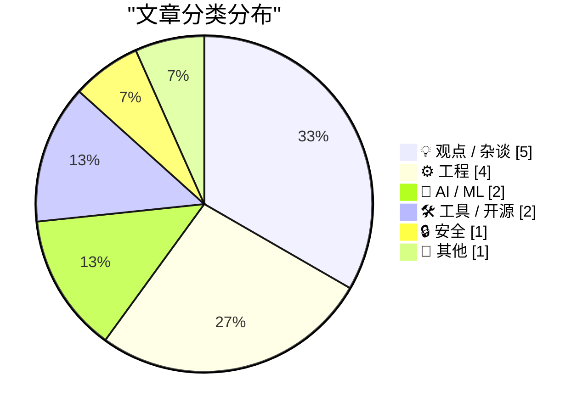
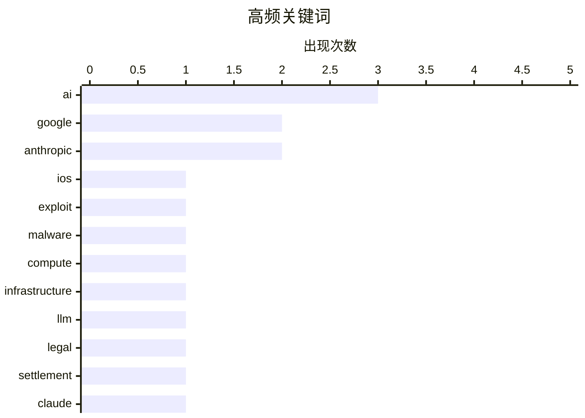

# 📰 AI 博客每日精选 — 2026-03-08

> 来自 Karpathy 推荐的 100 个顶级技术博客，AI 精选 Top 15

## 📝 今日看点

今日技术圈主要围绕AI生态的战略扩张与平台权力的激烈博弈展开。在AI领域，算力瓶颈引发关注，巨头们一方面通过开源扶持计划争夺开发者资源，另一方面加速向军事等敏感领域渗透。与此同时，网络安全与反垄断战火重燃，iOS神秘漏洞工具包的曝光以及Epic与Google的和解协议，凸显了科技巨头在应用分发与系统安全层面的深层较量。

---

## 🏆 今日必读

🥇 **Google 威胁情报小组关于 Coruna 的报告：一种来源神秘的强大 iOS 漏洞利用工具包**

[Google’s Threat Intelligence Group on Coruna, a Powerful iOS Exploit Kit of Mysterious Origin](https://cloud.google.com/blog/topics/threat-intelligence/coruna-powerful-ios-exploit-kit) — daringfireball.net · 1 天前 · 🔒 安全

> Google 威胁情报小组披露了一个名为“Coruna”的强大 iOS 漏洞利用工具包，其来源神秘。该工具包针对运行 iOS 13.0 至 17.2.1 版本的 Apple iPhone 机型，包含 5 个完整的 iOS 漏洞利用链和总共 23 个漏洞利用。其核心价值在于全面的 iOS 漏洞利用集合，展示了针对广泛 iOS 版本的强大能力。这一发现凸显了移动操作系统面临的持续且复杂的威胁，即使是最新的版本也难以幸免。

💡 **为什么值得读**: 深入了解针对广泛 iOS 版本的高级漏洞利用工具包细节，展示了当前移动威胁的复杂性。

🏷️ iOS, exploit, malware

🥈 **AI 算力危机是否已经到来？**

[Is the AI Compute Crunch Here?](https://martinalderson.com/posts/is-the-ai-compute-crunch-here/?utm_source=rss&amp;utm_medium=rss&amp;utm_campaign=feed) — martinalderson.com · 1 天前 · 🤖 AI / ML

> 文章探讨了 AI 算力基础设施的潜在瓶颈，特别是随着 AI 工具采用率的快速增长。它指出 Claude Code 目前拥有 200-300 万用户，约占全球知识型工作者的 1%。作者认为，随着用户基数扩大到知识型工作者的更大部分，满足这些 AI 模型训练和推理需求的计算资源需求将变得难以管理。目前的增长轨迹表明，如果硬件和基础设施扩展不能跟上步伐，严重的算力短缺即将来临。

💡 **为什么值得读**: 通过将用户增长与可用的算力资源联系起来，提供了关于 AI 扩展瓶颈的简短而发人深省的视角。

🏷️ AI, compute, infrastructure, LLM

🥉 **Tim Sweeney 签署协议放弃批评 Google Play 商店的权利直至 2032 年**

[Tim Sweeney Signed Away His Right to Criticize Google’s Play Store Until 2032](https://www.theverge.com/news/889595/tim-sweeney-signed-away-his-right-to-criticize-google-until-2032) — daringfireball.net · 1 天前 · 💡 观点 / 杂谈

> 报道披露，Epic Games 首席执行官 Tim Sweeney 在与 Google 的和解协议中签署了一份具有约束力的条款书。该协议禁止 Sweeney 批评 Google 的应用分发做法、费用及其对游戏和应用的处理，直至 2032 年。他进一步放弃了起诉或倡导进一步改变 Google 应用商店政策的权利，有效地限制了他过去积极倡导的反垄断立场。这一法律和解标志着 Sweeney 在公开反对 Google 商店做法方面出现了出人意料的战略逆转。

💡 **为什么值得读**: 揭示了 Epic 与 Google 法律战中的惊人转折，即 Sweeney 用其批评权换取了和解。

🏷️ Google, legal, settlement

---

## 📊 数据概览

| 扫描源 | 抓取文章 | 时间范围 | 精选 |
|:---:|:---:|:---:|:---:|
| 78/100 | 3198 篇 → 27 篇 | 48h | **15 篇** |

### 分类分布



### 高频关键词



<details>
<summary>📈 纯文本关键词图（终端友好）</summary>

```
ai             │ ████████████████████ 3
google         │ █████████████░░░░░░░ 2
anthropic      │ █████████████░░░░░░░ 2
ios            │ ███████░░░░░░░░░░░░░ 1
exploit        │ ███████░░░░░░░░░░░░░ 1
malware        │ ███████░░░░░░░░░░░░░ 1
compute        │ ███████░░░░░░░░░░░░░ 1
infrastructure │ ███████░░░░░░░░░░░░░ 1
llm            │ ███████░░░░░░░░░░░░░ 1
legal          │ ███████░░░░░░░░░░░░░ 1
```

</details>

### 🏷️ 话题标签

**ai**(3) · **google**(2) · **anthropic**(2) · ios(1) · exploit(1) · malware(1) · compute(1) · infrastructure(1) · llm(1) · legal(1) · settlement(1) · claude(1) · opensource(1) · pentagon(1) · defense(1) · epic(1) · antitrust(1) · package manager(1) · devtools(1) · software(1)

---

## 💡 观点 / 杂谈

### 1. Tim Sweeney 签署协议放弃批评 Google Play 商店的权利直至 2032 年

[Tim Sweeney Signed Away His Right to Criticize Google’s Play Store Until 2032](https://www.theverge.com/news/889595/tim-sweeney-signed-away-his-right-to-criticize-google-until-2032) — **daringfireball.net** · 1 天前 · ⭐ 25/30

> 报道披露，Epic Games 首席执行官 Tim Sweeney 在与 Google 的和解协议中签署了一份具有约束力的条款书。该协议禁止 Sweeney 批评 Google 的应用分发做法、费用及其对游戏和应用的处理，直至 2032 年。他进一步放弃了起诉或倡导进一步改变 Google 应用商店政策的权利，有效地限制了他过去积极倡导的反垄断立场。这一法律和解标志着 Sweeney 在公开反对 Google 商店做法方面出现了出人意料的战略逆转。

🏷️ Google, legal, settlement

---

### 2. Anthropic 与五角大楼

[Anthropic and the Pentagon](https://simonwillison.net/2026/Mar/6/anthropic-and-the-pentagon/#atom-everything) — **simonwillison.net** · 1 天前 · ⭐ 24/30

> 文章分析了近期五角大楼与 OpenAI 及 Anthropic 合同的背景，并引用了 Bruce Schneier 和 Nathan E. Sanders 的观点。它认为顶级 AI 模型正日益商品化，性能相似且差异化很小，这可能推动供应商寻求军事合同。报道提供了对涉及国家安全和 AI 技术供应商的伦理、战略和商业影响的最接地气的分析。作者断言，五角大楼的参与标志着 AI 商业格局的转变，即技术差异已不足以阻止与国防部门的合作。

🏷️ Anthropic, Pentagon, defense

---

### 3. The Verge 采访 Tim Sweeney：在“Epic 诉 Google”案胜诉之后

[The Verge Interviews Tim Sweeney After Victory in ‘Epic v. Google’](https://www.theverge.com/23996474/epic-tim-sweeney-interview-win-google-antitrust-lawsuit-district-court) — **daringfireball.net** · 1 天前 · ⭐ 24/30

> The Verge 采访了 Epic Games 首席执行官 Tim Sweeney，讨论了他在针对 Google 的反垄断诉讼中的胜利以及与针对 Apple 的案件相比的差异。Sweeney 将 Apple 描述为“冰”，指出其反垄断行为是内部的，利用其商店和支付系统对开发者和运营商施加统一条款。相比之下，他将 Google 描述为“火”，指出他们积极向游戏开发者付款并建立合作伙伴关系以维持 Android 的主导地位。Sweeney 的见解揭示了这两家科技巨头在维持其应用生态系统垄断地位方面所采取的不同策略。

🏷️ Epic, Google, antitrust

---

### 4. 多元化观点：有了 RSS，网络还可以忍受（2026 年 3 月 7 日）

[Pluralistic: The web is bearable with RSS (07 Mar 2026)](https://pluralistic.net/2026/03/07/reader-mode/) — **pluralistic.net** · 18 小时前 · ⭐ 21/30

> Cory Doctorow 的最新文章主张使用 RSS 和“阅读器模式”作为应对现代网络混乱的工具。他强调这些技术允许用户过滤掉广告、追踪器和干扰，使内容消费再次变得可以忍受。文章包含各种有趣的链接，涵盖物体恒存性、媒体谎言和政治活动资金等话题，展示策展内容的广度。Doctorow 重申，开放协议如 RSS 对于维护用户自主权和抵御大型科技平台的封闭花园至关重要。

🏷️ RSS, web, open web

---

### 5. 使用 Clankers 帮我度过手术恢复期

[Using Clankers to Help Me Process Surgery](https://xeiaso.net/blog/2026/surgery-recovery-clankers/) — **xeiaso.net** · 1 天前 · ⭐ 20/30

> 一篇个人叙事，描述了作者在手术恢复期间使用机械或数字实体寻求慰藉。作者提到了“Clankers”（可能指机械装置或特定的 AI/机器人实体），在凌晨 4 点的恢复期间提供了陪伴。文章强调了在脆弱时期，这些从不睡觉的机器所带来的持续、无判断的陪伴所带来的情感价值。这段经历展示了人类与机器之间独特的联系，机器在人类休息时提供稳定性和存在感。

🏷️ AI, personal, health

---

## ⚙️ 工程

### 6. 当 ReadDirectoryChangesW 报告删除事件时，如何获取被删除对象的更多信息？

[When Read­Directory­ChangesW reports that a deletion occurred, how can I learn more about the deleted thing?](https://devblogs.microsoft.com/oldnewthing/20260306-00/?p=112116) — **devblogs.microsoft.com/oldnewthing** · 1 天前 · ⭐ 22/30

> 文章解决了一个常见的 Windows 编程问题：如何在收到 `ReadDirectoryChangesW` 删除通知后检索有关已删除文件的信息。作者解释说，当 API 报告删除操作时，文件系统对象已经被移除，因此通过标准方法查询其属性已不可能。解决方案涉及主动监控；应用程序必须在删除发生前维护文件元数据的缓存或内存记录。这种技术限制意味着开发者必须预先构建状态跟踪，而不是依赖删除后的事件数据。

🏷️ Windows, API, filesystem

---

### 7. 开源基金会联盟宣布成立七个新工作组

[Announcing New Working Groups](https://nesbitt.io/2026/03/07/announcing-new-working-groups.html) — **nesbitt.io** · 1 天前 · ⭐ 20/30

> 开源基金会联盟宣布成立七个新的工作组，旨在应对开源生态系统中的关键挑战。这些工作组将聚焦于特定的技术领域或治理议题，通过促进成员间的协作来加速关键基础设施的发展。这一举措标志着开源社区在统一标准和资源整合方面迈出了重要一步。

🏷️ open-source, governance, consortium

---

### 8. 引用 Ally Piechowski：如何审计遗留的 Rails 代码库

[Quoting Ally Piechowski](https://simonwillison.net/2026/Mar/6/ally-piechowski/#atom-everything) — **simonwillison.net** · 1 天前 · ⭐ 19/30

> 文章引用了 Ally Piechowski 的观点，分享了在审计遗留 Rails 代码库时向开发团队和管理层提出的关键问题。针对开发人员，核心问题包括最不敢触碰的代码区域、上次周五部署的时间以及过去 90 天内测试未捕获的生产环境故障。对于 CTO 或工程经理，询问的重点则是受阻超过一年的功能以及是否具备实时的错误监控能力。这些问题直指技术债务和团队流程的痛点，有助于快速评估代码库的健康状况和团队效能。

🏷️ Rails, audit, legacy-code

---

### 9. PTP 挂钟既不切实际又过于精确

[A PTP Wall Clock is impractical and a little too precise](https://www.jeffgeerling.com/blog/2026/ptp-wall-clock-impractical-too-precise/) — **jeffgeerling.com** · 1 天前 · ⭐ 18/30

> 作者受 Oliver Ettlin 的演讲启发，尝试复现并测试 PTP（精确时间协议）挂钟的实际应用效果。虽然 PTP 协议能提供纳秒级的高精度时间同步，但作者发现将其用于物理挂钟既不切实际也过于精确。在日常使用场景中，这种极高的精度无法被肉眼察觉，且增加了不必要的系统复杂性。作者得出结论，PTP 时钟更适合作为网络同步技术的演示，而非实用的计时工具。

🏷️ PTP, time-sync, hardware

---

## 🤖 AI / ML

### 10. AI 算力危机是否已经到来？

[Is the AI Compute Crunch Here?](https://martinalderson.com/posts/is-the-ai-compute-crunch-here/?utm_source=rss&amp;utm_medium=rss&amp;utm_campaign=feed) — **martinalderson.com** · 1 天前 · ⭐ 26/30

> 文章探讨了 AI 算力基础设施的潜在瓶颈，特别是随着 AI 工具采用率的快速增长。它指出 Claude Code 目前拥有 200-300 万用户，约占全球知识型工作者的 1%。作者认为，随着用户基数扩大到知识型工作者的更大部分，满足这些 AI 模型训练和推理需求的计算资源需求将变得难以管理。目前的增长轨迹表明，如果硬件和基础设施扩展不能跟上步伐，严重的算力短缺即将来临。

🏷️ AI, compute, infrastructure, LLM

---

### 11. 面向开源项目的 Codex 计划

[Codex for Open Source](https://simonwillison.net/2026/Mar/7/codex-for-open-source/#atom-everything) — **simonwillison.net** · 18 小时前 · ⭐ 24/30

> 文章讨论了 OpenAI 和 Anthropic 针对热门开源项目维护者的新竞争性福利。继 Anthropic 为符合条件的开源项目维护者提供 6 个月免费 Claude Max 访问权限之后，OpenAI 推出了类似的“Codex for Open Source”优惠。OpenAI 的计划提供 6 个月的 ChatGPT Pro（每月 200 美元），其中包括 Codex 访问权限，适用于拥有 5,000+ stars 或 100 万+ NPM 下载量的项目。这一举措突显了主要 AI 公司在争夺开发者心智份额和将 AI 工具集成到开源工作流方面的激烈竞争。

🏷️ Claude, OpenSource, Anthropic

---

## 🛠 工具 / 开源

### 12. 如果它像包管理器那样叫唤

[If It Quacks Like a Package Manager](https://nesbitt.io/2026/03/08/if-it-quacks-like-a-package-manager.html) — **nesbitt.io** · 2 小时前 · ⭐ 23/30

> 文章批评了那些模仿包管理器行为但缺乏必要功能或可靠性的开发工具。作者将这些工具描述为“像包管理器一样摇摇摆摆”，暗示它们拥有包管理器的外观和感觉。然而，它们未能“学会游泳”，表明它们缺乏处理依赖管理、版本控制或安全性等核心任务的基本能力。这篇文章是对半成品工具的警告，敦促开发者坚持使用成熟、功能齐全的包管理解决方案。

🏷️ package manager, devtools, software

---

### 13. ‘npx workos’：利用 AI Agent 自动集成认证功能

[‘npx workos’](https://workos.com/docs/authkit/cli-installer?utm_source=tldrdev&amp;utm_medium=newsletter&amp;utm_campaign=q12026) — **daringfireball.net** · 13 小时前 · ⭐ 18/30

> WorkOS 发布了一款名为 `npx workos` 的 CLI 工具，利用 AI Agent 为现有代码库自动编写认证集成方案。该工具基于 Claude 模型，能够读取项目代码、识别框架并生成适配的集成代码，而非简单的模板生成。系统还会自动进行类型检查和构建，将错误反馈给 AI 自我修复以确保代码质量。这为开发者提供了一种通过 AI 自动化解决繁琐 SDK 集成问题的高效方案。

🏷️ CLI, auth, AI-agent

---

## 🔒 安全

### 14. Google 威胁情报小组关于 Coruna 的报告：一种来源神秘的强大 iOS 漏洞利用工具包

[Google’s Threat Intelligence Group on Coruna, a Powerful iOS Exploit Kit of Mysterious Origin](https://cloud.google.com/blog/topics/threat-intelligence/coruna-powerful-ios-exploit-kit) — **daringfireball.net** · 1 天前 · ⭐ 28/30

> Google 威胁情报小组披露了一个名为“Coruna”的强大 iOS 漏洞利用工具包，其来源神秘。该工具包针对运行 iOS 13.0 至 17.2.1 版本的 Apple iPhone 机型，包含 5 个完整的 iOS 漏洞利用链和总共 23 个漏洞利用。其核心价值在于全面的 iOS 漏洞利用集合，展示了针对广泛 iOS 版本的强大能力。这一发现凸显了移动操作系统面临的持续且复杂的威胁，即使是最新的版本也难以幸免。

🏷️ iOS, exploit, malware

---

## 📝 其他

### 15. 阅读清单：数据中心脱网、太阳能光伏效率记录及其他

[Reading List 03/07/2026](https://www.construction-physics.com/p/reading-list-03072026) — **construction-physics.com** · 23 小时前 · ⭐ 19/30

> 本期阅读清单涵盖了数据中心能源管理、太阳能技术进展、战略石油储备维修以及电动汽车行业动态等多个领域的新闻。文章讨论了数据中心脱离电网运行的趋势以及太阳能光伏效率的最新记录，同时分析了福特在电动汽车战略上的失误。此外，清单还提到了前 OpenAI CTO 创立新公司的动向。这些内容为关注能源、建筑和科技行业的读者提供了广泛的视野和最新的行业洞察。

🏷️ data-centers, energy, AI

---

*生成于 2026-03-08 12:29 | 扫描 78 源 → 获取 3198 篇 → 精选 15 篇*
*基于 [Hacker News Popularity Contest 2025](https://refactoringenglish.com/tools/hn-popularity/) RSS 源列表，由 [Andrej Karpathy](https://x.com/karpathy) 推荐*
*由「懂点儿AI」制作，欢迎关注同名微信公众号获取更多 AI 实用技巧 💡*
