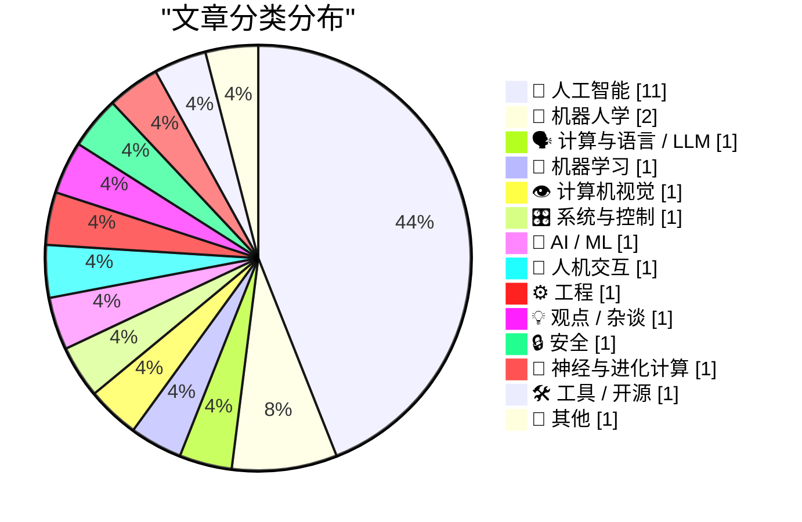
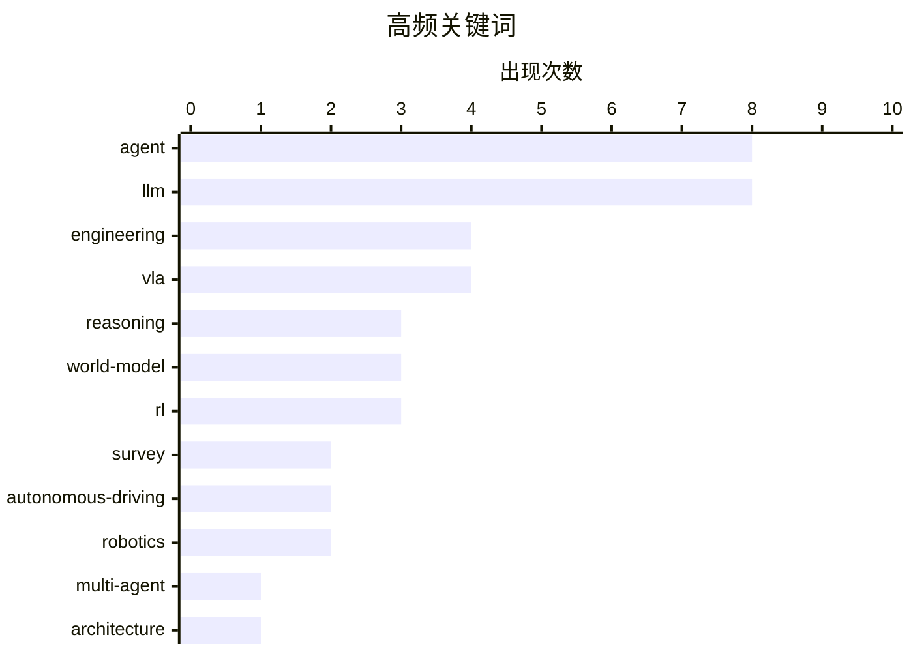

# 📰 AI 博客每日精选 — 2026-03-11

> 来自 Karpathy 推荐的 110 个顶级技术博客，AI 精选 Top 25

## 📝 今日看点

今日技术圈聚焦于AI智能体架构的深度演进，研究重点从单一的提示词工程转向具备演进式认知与内存管理的自主多智能体系统。在自动驾驶与具身智能领域，生成式世界模型与视觉-语言-动作模型的融合正在突破感知与规划的局限，推动系统向更高层级的自主性发展。与此同时，模型合并与新型推理范式成为提升大模型计算效率与生成质量的关键技术路径。

---

## ⚠️ Feeds状态

成功获取 104/110 个feeds，5 个失败

### 🌐 网络错误 (3)

- **evanhahn.com**: The socket connection was closed unexpectedly. For more information, pass `verbose: true` in the second argument to fetch()
- **worksonmymachine.substack.com**: The socket connection was closed unexpectedly. For more information, pass `verbose: true` in the second argument to fetch()
- **AWS Machine Learning**: The socket connection was closed unexpectedly. For more information, pass `verbose: true` in the second argument to fetch()

### ❓ 其他错误 (2)

- **paulgraham.com**: Unable to connect. Is the computer able to access the url?
- **mjg59.dreamwidth.org**: HTTP 504 - Gateway Time-out

---

## 🏆 今日必读

🥇 **上下文工程：从提示词到企业级多智能体架构**

[Context Engineering: From Prompts to Corporate Multi-Agent Architecture](https://arxiv.org/abs/2603.09619) — ArXiv CS.AI · 9 小时前 · 🤖 人工智能

> 随着人工智能系统从无状态聊天机器人向自主多智能体演进，仅依靠提示词工程已显得力不从心。文章提出了“上下文工程”这一独立学科，旨在设计、构建和管理 AI 智能体决策所需的整个信息环境。该研究借鉴了 Google 等供应商的架构，定义了一个超越单一查询的系统性框架，以支持复杂的决策流程。上下文工程通过结构化信息管理，解决了传统提示词在处理复杂、长期任务时的局限性。这为构建能够适应企业级需求的多智能体系统提供了新的理论基础和实践方向。

💡 **为什么值得读**: 它首次系统性地提出了“上下文工程”概念，为构建企业级复杂 AI 智能体提供了超越传统提示词工程的全新理论框架。

🏷️ multi-agent, architecture, context-engineering, agent

🥈 **大语言模型时代的模型合并：方法、应用与未来方向**

[Model Merging in the Era of Large Language Models: Methods, Applications, and Future Directions](https://arxiv.org/abs/2603.09938) — ArXiv CS.CL (LLM/NLP) · 9 小时前 · 🗣️ 计算与语言 / LLM

> 模型合并作为一种新兴范式，能够在不进行额外训练的情况下将多个神经网络的能力整合到统一模型中。随着微调大语言模型数量的激增，模型合并技术提供了一种比模型集成和全量重训练计算效率更高的替代方案。这篇综述全面概述了参数平均、权重合并和任务向量等合并方法，并探讨了它们在低成本组合特定领域能力方面的应用。文章指出，模型合并能够有效整合不同模型的专业知识，同时避免重新训练带来的高昂计算成本。研究还展望了未来方向，包括如何合并异构模型以及缓解潜在的任务干扰。

💡 **为什么值得读**: 这是一篇关于模型合并技术的全面综述，展示了如何以极低成本组合多个 AI 模型的能力，对于优化 LLM 部署具有重要参考价值。

🏷️ model-merging, LLM, survey, engineering

🥉 **Latent-DARM：弥合离散扩散与自回归模型以用于推理**

[Latent-DARM: Bridging Discrete Diffusion And Autoregressive Models For Reasoning](https://arxiv.org/abs/2603.09184) — ArXiv CS.LG (ML) · 9 小时前 · 🧠 机器学习

> 当前多智能体系统主要依赖基于顺序生成的自回归语言模型，这在全局推理和规划修订方面存在显著局限。虽然离散扩散语言模型支持非顺序、全局可修订的生成并表现出强大的规划能力，但其文本流畅度不足限制了与自回归模型的直接协作。研究提出了 Latent-DARM 框架，通过在潜在空间中桥接离散扩散和自回归生成，结合了前者的推理能力和后者的流畅性。该模型通过解耦推理过程和文本生成，实现了高质量的文本输出和可修订的规划能力。实验表明，Latent-DARM 在需要复杂推理和规划的多智能体任务中表现出色。

💡 **为什么值得读**: 它创新性地结合了扩散模型和自回归模型的优势，解决了复杂推理任务中流畅性与可修订性难以兼得的难题。

🏷️ diffusion-models, autoregressive, reasoning, agent

---

## 📊 数据概览

| 扫描源 | 抓取文章 | 时间范围 | 精选 |
|:---:|:---:|:---:|:---:|
| 104/110 | 4633 篇 → 1229 篇 | 48h | **25 篇** |

### 分类分布



### 高频关键词



<details>
<summary>📈 纯文本关键词图（终端友好）</summary>

```
agent              │ ████████████████████ 8
llm                │ ████████████████████ 8
engineering        │ ██████████░░░░░░░░░░ 4
vla                │ ██████████░░░░░░░░░░ 4
reasoning          │ ████████░░░░░░░░░░░░ 3
world-model        │ ████████░░░░░░░░░░░░ 3
rl                 │ ████████░░░░░░░░░░░░ 3
survey             │ █████░░░░░░░░░░░░░░░ 2
autonomous-driving │ █████░░░░░░░░░░░░░░░ 2
robotics           │ █████░░░░░░░░░░░░░░░ 2
```

</details>

### 🏷️ 话题标签

**agent**(8) · **llm**(8) · **engineering**(4) · vla(4) · reasoning(3) · world-model(3) · rl(3) · survey(2) · autonomous-driving(2) · robotics(2) · multi-agent(1) · architecture(1) · context-engineering(1) · model-merging(1) · diffusion-models(1) · autoregressive(1) · vision-language-action(1) · automated-driving(1) · memory(1) · cognition(1)

---

## 🤖 人工智能

### 1. 上下文工程：从提示词到企业级多智能体架构

[Context Engineering: From Prompts to Corporate Multi-Agent Architecture](https://arxiv.org/abs/2603.09619) — **ArXiv CS.AI** · 9 小时前 · ⭐ 29/30

> 随着人工智能系统从无状态聊天机器人向自主多智能体演进，仅依靠提示词工程已显得力不从心。文章提出了“上下文工程”这一独立学科，旨在设计、构建和管理 AI 智能体决策所需的整个信息环境。该研究借鉴了 Google 等供应商的架构，定义了一个超越单一查询的系统性框架，以支持复杂的决策流程。上下文工程通过结构化信息管理，解决了传统提示词在处理复杂、长期任务时的局限性。这为构建能够适应企业级需求的多智能体系统提供了新的理论基础和实践方向。

🏷️ multi-agent, architecture, context-engineering, agent

---

### 2. AutoAgent：演进式认知与弹性内存编排的自适应智能体

[AutoAgent: Evolving Cognition and Elastic Memory Orchestration for Adaptive Agents](https://arxiv.org/abs/2603.09716) — **ArXiv CS.AI** · 9 小时前 · ⭐ 29/30

> 当前的自主智能体框架难以协调长期经验学习与实时的上下文敏感决策，导致在开放和非平稳环境中适应性受限。AutoAgent 作为一个自我演进的多智能体框架，通过演进式认知、弹性内存编排和动态工作流重构三个紧密耦合的组件来解决这一局限。该框架允许智能体根据长期经验动态更新其认知结构，并优化内存使用以提高效率，从而摆脱静态认知和僵化工作流的束缚。实验表明，AutoAgent 在处理复杂、动态的任务时表现出更强的适应性和鲁棒性。该研究为构建能够在开放环境中持续学习和进化的智能体提供了新的思路。

🏷️ agent, memory, cognition, orchestration

---

### 3. Design Conductor：一个自主构建 1.5 GHz Linux 可运行 RISC-V CPU 的智能体

[Design Conductor: An agent autonomously builds a 1.5 GHz Linux-capable RISC-V CPU](https://arxiv.org/abs/2603.08716) — **ArXiv CS.AI** · 9 小时前 · ⭐ 29/30

> 研究探索了将前沿模型应用于半导体设计，实现从概念到可用于流片的 GDSII 版图文件的端到端自动化。Design Conductor (DC) 是一个自主智能体，能够在 12 小时内完全自主地构建多个 RISC-V CPU (VerCore) 的微架构变体。该 CPU 使用 ASAP7 PDK，满足 1.48 GHz (rv32i-zmmul) 的时序要求，仅从一个 219 字的需求规范开始设计。DC 展示了 AI 智能体在处理复杂硬件设计流程方面的能力，包括架构设计、逻辑综合和物理设计。这一成果标志着芯片设计自动化的重大飞跃，证明了 AI 可以在极短时间内完成人类专家需数月的工作。

🏷️ agent, chip-design, RISC-V, autonomous

---

### 4. 缺失的内存层次结构：LLM 上下文窗口的按需分页

[The Missing Memory Hierarchy: Demand Paging for LLM Context Windows](https://arxiv.org/abs/2603.09023) — **ArXiv CS.AI** · 9 小时前 · ⭐ 29/30

> 大语言模型的上下文窗口常被误视为整个内存系统，实际上它更像 L1 缓存：小、快且昂贵，缺乏 L2 缓存、虚拟内存或分页机制。分析显示，在 857 个生产会话和 445 万个有效输入 token 中，21.8% 是结构性浪费，包括工具定义、系统提示词和过时的工具结果。文章提出了一种“按需分页”系统，动态地将上下文数据移入和移出活跃窗口，将上下文视为分页内存系统而非静态缓冲区。该系统通过智能管理上下文数据，显著减少了不必要的 token 消耗，降低了 API 调用成本和延迟。研究表明，引入内存层次结构可以在保持模型性能的同时，大幅扩展 LLM 可处理的信息量。

🏷️ LLM, context-window, memory-hierarchy, engineering

---

### 5. 从流模型到单步：基于隐式最大似然估计分布蒸馏的实时多模态轨迹策略

[From Flow to One Step: Real-Time Multi-Modal Trajectory Policies via Implicit Maximum Likelihood Estimation-based Distribution Distillation](https://arxiv.org/abs/2603.09415) — **ArXiv CS.AI** · 9 小时前 · ⭐ 29/30

> 基于扩散和流匹配的生成式策略在机器人操作中表现优异，但其对迭代常微分方程 (ODE) 积分的依赖导致了高延迟，限制了高频闭环控制的应用。虽然最近的单步加速方法减少了计算开销，但往往导致分布坍缩，生成平均化且次优的轨迹。研究提出了一种基于隐式最大似然估计 (IMLE) 的分布蒸馏方法，将迭代流模型提炼为单步模型，同时保持多模态分布的完整性。该方法在实现实时推理速度的同时，保留了原始策略的多模态特性和质量。实验证明，该策略在机器人操作任务中实现了高频控制，且性能接近原始迭代模型。

🏷️ robotics, flow-matching, real-time, distillation

---

### 6. 编译器优先的状态空间对偶与可移植的 $O(1)$ 自回归缓存推理

[Compiler-First State Space Duality and Portable $O(1)$ Autoregressive Caching for Inference](https://arxiv.org/abs/2603.09555) — **ArXiv CS.AI** · 9 小时前 · ⭐ 29/30

> 当前状态空间模型通常依赖融合的 CUDA 和 Triton 内核，导致对 NVIDIA 硬件有硬性依赖。作者证明 Mamba-2 的状态空间对偶算法（对角状态结构、可分块循环和静态控制流下的 einsum 主导计算）能完美映射到 XLA 的融合和分块优化过程中，从而使得定制内核成为可选项而非必需品。研究人员实现了完整的推理系统，利用标准 JAX/XLA 编译器在 GPU、TPU 和 CPU 上实现了高性能。这种方法解耦了 SSM 部署与特定硬件供应商的绑定，实现了跨平台的高效推理。此外，系统还支持可移植的 $O(1)$ 自回归缓存机制，进一步优化了推理性能。

🏷️ SSM, Mamba, inference, compiler

---

### 7. 从自进化合成数据到可验证奖励强化学习：后训练多轮交互式工具使用智能体

[From Self-Evolving Synthetic Data to Verifiable-Reward RL: Post-Training Multi-turn Interactive Tool-Using Agents](https://arxiv.org/abs/2601.22607) — **ArXiv CS.AI** · 9 小时前 · ⭐ 29/30

> 交互式工具使用智能体需要通过多轮对话和工具执行来解决复杂任务，但高质量多轮数据的合成和强化学习中的信号噪声是后训练的主要挑战。针对数据合成难的问题，作者提出了一种自进化合成数据生成方法，能够自动构建高质量的交互轨迹。为了解决用户模拟带来的噪声，研究引入了基于可验证奖励的强化学习框架，利用确定性的环境反馈指导模型优化。该框架显著提升了智能体在多轮对话、状态跟踪和工具执行方面的能力。实验结果表明，这种方法在复杂任务中优于传统的监督学习和基于模拟的 RL 方法。

🏷️ post-training, agent, RL, synthetic-data

---

### 8. 通过自适应思维链压缩实现高效推理：一个自优化框架

[Reasoning Efficiently Through Adaptive Chain-of-Thought Compression: A Self-Optimizing Framework](https://arxiv.org/abs/2509.14093) — **ArXiv CS.AI** · 9 小时前 · ⭐ 29/30

> 思维链虽然提升了大模型的推理能力，但也带来了计算成本高、延迟大和 KV Cache 占用过多的问题，这在需要简洁输出的软件工程任务中尤为突出。作者提出了一种自适应思维链压缩框架，能够根据任务复杂度动态调整中间推理步骤的详细程度。该框架通过自优化机制识别冗余的推理步骤并进行压缩，在不牺牲最终答案准确性的前提下减少输出 Token 数量。这种方法显著降低了推理延迟和内存消耗，同时保持了模型在算术、逻辑和常识任务上的性能。实验证明，该框架在保证效率的同时，能够维持甚至提升推理的鲁棒性。

🏷️ CoT, reasoning, efficiency, LLM

---

### 9. Pri4R：利用特权 4D 表征为视觉-语言-动作模型学习世界动力学

[Pri4R: Learning World Dynamics for Vision-Language-Action Models with Privileged 4D Representation](https://arxiv.org/abs/2603.01549) — **ArXiv CS.AI** · 9 小时前 · ⭐ 29/30

> 现有的视觉-语言-动作（VLA）模型虽然在语义理解上表现出色，但往往缺乏对物理交互时空动力学的理解。作者提出了 Pri4R 方法，通过引入“特权 4D 表征”让模型隐式地学习世界动态规律，即理解动作如何影响周围环境。该方法利用包含深度和时间信息的特权数据增强训练，使模型能够预测动作后果并更好地处理物理交互。Pri4R 架构简单有效，能够无缝集成到现有的 VLA 模型中。研究结果表明，赋予模型世界动力学理解能力能显著提升其在机器人操作任务中的表现。

🏷️ VLA, world-model, robotics, embodiment

---

### 10. 将推理视为梯度：超越树搜索的机器学习工程智能体扩展

[Reasoning as Gradient: Scaling MLE Agents Beyond Tree Search](https://arxiv.org/abs/2603.01692) — **ArXiv CS.AI** · 9 小时前 · ⭐ 29/30

> 现有的基于大模型的机器学习工程（MLE）智能体主要依赖树搜索，这是一种无梯度优化方法，随着模型推理能力的提升，穷举式搜索变得越来越低效。作者提出了 Gome 智能体，它利用 LLM 的推理能力生成类似梯度的信号，以指导搜索方向，从而替代传统的候选方案穷举。这种方法类似于在优化问题中使用精确梯度代替随机搜索，能够更直接地引导模型找到最优解。Gome 在复杂的机器学习任务中展示了比传统树搜索更高的效率和性能。这一研究标志着从暴力搜索向推理引导优化的范式转变，为构建更强大的自主智能体开辟了新路径。

🏷️ agent, reasoning, LLM, optimization

---

### 11. 自主智能体系统的治理架构：威胁、框架与工程实践

[Governance Architecture for Autonomous Agent Systems: Threats, Framework, and Engineering Practice](https://arxiv.org/abs/2603.07191) — **ArXiv CS.AI** · 9 小时前 · ⭐ 29/30

> 大语言模型驱动的自主智能体引入了一类执行层漏洞（如提示注入、检索投毒和不受控的工具调用），现有的防护措施无法系统性地解决这些问题。作者提出了分层治理架构（LGA），这是一个包含执行沙箱（L1）、意图验证（L2）、零信任智能体间授权（L3）等在内的四层框架。LGA 通过分层隔离和严格的权限控制，系统地缓解了智能体在运行时面临的安全威胁，确保智能体行为符合预期且可控。该架构还提供了具体的工程实践指南，帮助开发者在实际系统中部署这些安全措施。这一工作为构建安全、可靠的自主智能体系统提供了标准化的参考。

🏷️ agent, governance, security, engineering

---

## 🦾 机器人学

### 12. 自动驾驶的潜在世界模型：统一分类法、评估框架与开放挑战

[Latent World Models for Automated Driving: A Unified Taxonomy, Evaluation Framework, and Open Challenges](https://arxiv.org/abs/2603.09086) — **ArXiv CS.RO (Robotics)** · 9 小时前 · ⭐ 29/30

> 新兴的生成式世界模型和视觉-语言-动作系统正在通过可扩展的模拟、长期预测和丰富的决策能力重塑自动驾驶领域。潜在表征作为核心计算基底层，压缩高维多传感器观测数据，支持时间上连贯的推演，并为规划和推理提供接口。该研究提出了一个统一的分类法，根据表征学习、动力学建模和评估指标对潜在世界模型进行分类，并建立了一个综合评估框架。文章回顾了当前最先进的技术，分析了它们在自动驾驶场景中的优势和局限性。研究还指出了分布外泛化等关键开放挑战，为未来的研究方向提供了指导。

🏷️ world-model, automated-driving, survey, VLA

---

### 13. TiPToP：用于机器人操作的模块化开放词汇规划系统

[TiPToP: A Modular Open-Vocabulary Planning System for Robotic Manipulation](https://arxiv.org/abs/2603.09971) — **ArXiv CS.RO (Robotics)** · 9 小时前 · ⭐ 29/30

> 文章介绍了 TiPToP，一个可扩展的模块化系统，结合了预训练视觉基础模型和现有的任务与运动规划器（TAMP），直接从 RGB 图像和自然语言指令中解决多步操作任务。该系统旨在简单易用，可以在标准的 DROID 设置上在一小时内安装和运行，并能以最小的努力适应新的硬件形态。TiPToP 利用视觉基础模型进行开放词汇的物体识别和场景理解，将感知信息转化为 TAMP 可处理的符号表示。评估结果显示，TiPToP 在处理未见过的物体和指令时表现出强大的泛化能力。这一工作展示了将基础模型与经典规划算法结合的巨大潜力。

🏷️ open-vocabulary, planning, foundation-model, TAMP

---

## 🗣️ 计算与语言 / LLM

### 14. 大语言模型时代的模型合并：方法、应用与未来方向

[Model Merging in the Era of Large Language Models: Methods, Applications, and Future Directions](https://arxiv.org/abs/2603.09938) — **ArXiv CS.CL (LLM/NLP)** · 9 小时前 · ⭐ 29/30

> 模型合并作为一种新兴范式，能够在不进行额外训练的情况下将多个神经网络的能力整合到统一模型中。随着微调大语言模型数量的激增，模型合并技术提供了一种比模型集成和全量重训练计算效率更高的替代方案。这篇综述全面概述了参数平均、权重合并和任务向量等合并方法，并探讨了它们在低成本组合特定领域能力方面的应用。文章指出，模型合并能够有效整合不同模型的专业知识，同时避免重新训练带来的高昂计算成本。研究还展望了未来方向，包括如何合并异构模型以及缓解潜在的任务干扰。

🏷️ model-merging, LLM, survey, engineering

---

## 🧠 机器学习

### 15. Latent-DARM：弥合离散扩散与自回归模型以用于推理

[Latent-DARM: Bridging Discrete Diffusion And Autoregressive Models For Reasoning](https://arxiv.org/abs/2603.09184) — **ArXiv CS.LG (ML)** · 9 小时前 · ⭐ 29/30

> 当前多智能体系统主要依赖基于顺序生成的自回归语言模型，这在全局推理和规划修订方面存在显著局限。虽然离散扩散语言模型支持非顺序、全局可修订的生成并表现出强大的规划能力，但其文本流畅度不足限制了与自回归模型的直接协作。研究提出了 Latent-DARM 框架，通过在潜在空间中桥接离散扩散和自回归生成，结合了前者的推理能力和后者的流畅性。该模型通过解耦推理过程和文本生成，实现了高质量的文本输出和可修订的规划能力。实验表明，Latent-DARM 在需要复杂推理和规划的多智能体任务中表现出色。

🏷️ diffusion-models, autoregressive, reasoning, agent

---

## 👁️ 计算机视觉

### 16. EvoDriveVLA：通过协作感知-规划蒸馏演进的自动驾驶视觉-语言-动作模型

[EvoDriveVLA: Evolving Autonomous Driving Vision-Language-Action Model via Collaborative Perception-Planning Distillation](https://arxiv.org/abs/2603.09465) — **ArXiv CS.CV (Vision)** · 9 小时前 · ⭐ 29/30

> 视觉-语言-动作模型在自动驾驶领域展现出巨大潜力，但在解冻视觉编码器后常面临感知退化，且在长期规划中存在累积不稳定性。文章提出了 EvoDriveVLA 框架，通过协作感知-规划蒸馏来解决这些问题，集成了自锚定感知约束和神谕引导的轨迹优化。自锚定感知约束在视觉编码器微调期间保持感知一致性，而轨迹优化则通过蒸馏技术稳定长期规划过程。该方法有效缓解了感知性能下降和规划轨迹不稳定的问题，提升了模型的鲁棒性。结果表明，EvoDriveVLA 在自动驾驶场景中实现了更可靠的感知和规划性能。

🏷️ VLA, autonomous-driving, vision-language-action

---

## 🎛️ 系统与控制

### 17. 自动驾驶的潜在世界模型：统一分类法、评估框架与开放挑战

[Latent World Models for Automated Driving: A Unified Taxonomy, Evaluation Framework, and Open Challenges](https://arxiv.org/abs/2603.09086) — **ArXiv CS.SY (Control)** · 9 小时前 · ⭐ 29/30

> 新兴的生成式世界模型和视觉-语言-动作系统正在通过可扩展的模拟、长期预测和丰富的决策能力重塑自动驾驶领域。潜在表征作为核心计算基底层，压缩高维多传感器观测数据，支持时间上连贯的推演，并为规划和推理提供接口。该研究提出了一个统一的分类法，根据表征学习、动力学建模和评估指标对潜在世界模型进行分类，并建立了一个综合评估框架。文章回顾了当前最先进的技术，分析了它们在自动驾驶场景中的优势和局限性。研究还指出了分布外泛化等关键开放挑战，为未来的研究方向提供了指导。

🏷️ world-model, VLA, autonomous-driving

---

## 🤖 AI / ML

### 18. 提升前沿大模型中的指令层级

[Improving instruction hierarchy in frontier LLMs](https://openai.com/index/instruction-hierarchy-challenge) — **OpenAI News** · 1 天前 · ⭐ 28/30

> OpenAI 发布了关于提升模型指令层级的研究，旨在解决模型在面对系统指令和用户指令冲突时的优先级判断问题。通过 IH-Challenge 训练模型，使其能够优先信任系统或开发者的指令，而非用户可能包含恶意意图的输入。该训练方法增强了模型的安全性可引导性，显著提高了模型对提示注入攻击的抵抗力。这意味着模型在面对试图越狱或操纵模型的复杂提示时，能够更坚定地遵循核心安全准则。这一进展有效提升了前沿模型在真实应用中的安全性和可靠性。

🏷️ LLM, safety, alignment, prompt-injection

---

## 👤 人机交互

### 19. 门诊初级保健诊所中对话式诊断 AI 的前瞻性临床可行性研究

[A prospective clinical feasibility study of a conversational diagnostic AI in an ambulatory primary care clinic](https://arxiv.org/abs/2603.08448) — **ArXiv CS.HC (HCI)** · 9 小时前 · ⭐ 28/30

> 基于大语言模型的 AI 系统在模拟诊断对话中展现出潜力，但其在真实临床工作流中的应用仍需严格的安全评估。本研究报告了对话式 AI 系统 AMIE 在门诊初级保健诊所中进行病史采集的前瞻性单臂可行性研究。研究重点评估了 AI 在真实患者交互中的安全性、诊断准确性和对话质量，并由医生进行实时监督。初步结果表明，AMIE 能够在安全范围内完成病史采集任务，且患者和医生的反馈总体积极。这一研究为未来 AI 辅助诊疗系统的临床落地提供了重要的实证依据。

🏷️ LLM, healthcare, diagnostic

---

## ⚙️ 工程

### 20. AI 应该帮助我们写出更好的代码

[AI should help us produce better code](https://simonwillison.net/guides/agentic-engineering-patterns/better-code/#atom-everything) — **simonwillison.net** · 14 小时前 · ⭐ 26/30

> 文章讨论了开发者对于使用 AI 工具编写代码会导致质量下降的担忧，指出如果 AI 代理导致代码质量降低，应该直接解决这一问题。作者强调，采用编码代理的目标不应仅仅是提高速度，而应利用 AI 来提升代码质量、可维护性和测试覆盖率。文章建议将任务原子化，让 AI 专注于处理微小的、独立的代码单元，并通过编写详尽的测试来确保 AI 生成的代码符合高质量标准。正确的工程模式可以确保 AI 帮助开发者生产出比人工编写质量更高的代码，而非制造技术债务。文章呼吁开发者主动定义“更好的代码”标准，并利用 AI 工具来实现这一目标。

🏷️ LLM, agent, engineering, code-generation

---

## 💡 观点 / 杂谈

### 21. 从游戏到生物学及其他：AlphaGo 影响的十年

[From games to biology and beyond: 10 years of AlphaGo’s impact](https://deepmind.google/blog/10-years-of-alphago/) — **Google DeepMind** · 1 天前 · ⭐ 26/30

> 文章回顾了 AlphaGo 诞生十周年以来的深远影响，探讨了其如何从围棋游戏走向科学发现并推动通用人工智能（AGI）的发展。AlphaGo 不仅证明了深度强化学习掌握复杂策略的能力，更催化了 AlphaFold 等技术在生物学、材料科学和数学等领域的应用。这一技术演进标志着 AI 模型从专用系统向通用基础模型的转变，极大地加速了人类解决复杂科学难题的进程。DeepMind 总结认为，AlphaGo 的遗产在于它展示了 AI 作为科学发现工具的巨大潜力，为通往 AGI 铺平了道路。

🏷️ AlphaGo, RL, AGI, biology

---

## 🔒 安全

### 22. 肯尼亚低薪承包商在使用 Meta AI 智能眼镜时所见即用户所见

[Low-Wage Contractors in Kenya See What Users See While Using Meta’s AI Smart Glasses](https://www.svd.se/a/K8nrV4/metas-ai-smart-glasses-and-data-privacy-concerns-workers-say-we-see-everything) — **daringfireball.net** · 1 天前 · ⭐ 25/30

> 调查报道揭露了 Meta AI 智能眼镜背后的数据隐私漏洞，指出肯尼亚的低薪合同工能够接触到用户拍摄的所有视频内容。这些工人在内罗毕恶劣的工作环境下，负责标记来自智能眼镜的数据，其中包括用户并未意识到的私密和敏感瞬间。这一发现与 Meta 宣称的隐私保护措施形成鲜明对比，揭示了科技巨头在训练 AI 模型过程中对用户隐私和劳工权益的忽视。报道强调，在智能眼镜日益普及的背景下，缺乏透明度的数据处理流程对个人隐私构成了严重威胁。

🏷️ privacy, Meta, smart-glasses, AI-ethics

---

## 🔮 神经与进化计算

### 23. 多模态大语言模型辅助的程式化控制策略进化搜索

[Multimodal LLM-assisted Evolutionary Search for Programmatic Control Policies](https://arxiv.org/abs/2508.05433) — **ArXiv CS.NE (Neural)** · 9 小时前 · ⭐ 25/30

> 论文针对深度强化学习策略缺乏可解释性和难以调试的问题，提出了一种发现程式化控制策略的新方法。该研究引入了多模态大语言模型辅助进化搜索，利用进化算法优化人类可读的代码策略，并由多模态 LLM 提供指导。这种方法生成的策略不再是难以理解的黑盒神经网络，而是透明、可验证且易于调试的代码逻辑。实验结果显示，该方法在保持竞争力的控制性能的同时，显著提升了策略的可解释性，有助于在现实世界中建立对 AI 控制系统的信任。

🏷️ LLM, evolutionary-search, RL, interpretable-policies

---

## 🛠 工具 / 开源

### 24. ABB 利用 NVIDIA Omniverse 库增强 RobotStudio

[ABB boosts RobotStudio with NVIDIA Omniverse libraries](https://www.therobotreport.com/abb-boosts-robotstudio-with-nvidia-omniverse-libraries/) — **The Robot Report** · 1 天前 · ⭐ 22/30

> ABB 宣布将在其 RobotStudio 软件中集成 NVIDIA Omniverse 库，以提升工业机器人的仿真能力。此次合作将推出订阅制的 RobotStudio HyperReality 模拟器，计划于 2026 年下半年发布，旨在提供物理级保真度的可视化和模拟体验。通过利用 NVIDIA 的技术，用户能够更精确地验证和优化机器人程序，从而在虚拟环境中解决现实世界的自动化挑战。这一举措标志着工业仿真技术的重大进步，将帮助工程师在构建物理系统前实现更高效的测试与部署。

🏷️ simulation, Omniverse, digital-twin

---

## 📝 其他

### 25. MacBook Neo

[★ The MacBook Neo](https://daringfireball.net/2026/03/the_macbook_neo) — **daringfireball.net** · 14 小时前 · ⭐ 17/30

> 文章对假设或未来的 MacBook Neo 进行了点评，探讨了这款产品在 Apple 产品线中的定位及其命名背后的哲学。作者指出，“Neo”（新）这个名字暗示了某种革新或重塑，但同时也表达了对该产品能够经久不衰、历久弥新的美好祝愿。评论反映了作者对技术产品快速迭代周期的思考，希望这款设备能够超越“新”的标签，成为具有持久价值的经典。最终观点认为，真正优秀的产品应当具有长久的生命力，以至于其名字中的“新”字最终变得不再适用。

🏷️ Apple, hardware, MacBook, review

---

*生成于 2026-03-11 13:00 | 扫描 104 源 → 获取 4633 篇 → 精选 25 篇*
*基于 [Hacker News Popularity Contest 2025](https://refactoringenglish.com/tools/hn-popularity/) RSS 源列表，由 [Andrej Karpathy](https://x.com/karpathy) 推荐*
*由「懂点儿AI」制作，欢迎关注同名微信公众号获取更多 AI 实用技巧 💡*
