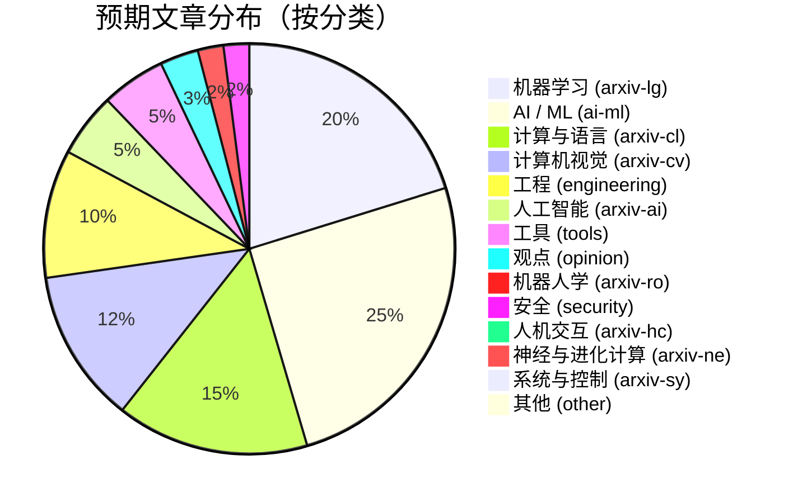

# AI Daily Digest - 分类体系总览

> 14 个内容分类的可视化展示

## 🏗️ 分类架构图

```
AI Daily Digest 内容分类体系
│
├─ 🏷️ 基础分类（6 个）- 适用于博客、媒体文章
│  ├─ 🤖 ai-ml        - AI / ML
│  ├─ 🔒 security     - 安全
│  ├─ ⚙️  engineering  - 工程
│  ├─ 🛠️ tools        - 工具 / 开源
│  ├─ 💡 opinion      - 观点 / 杂谈
│  └─ 📝 other        - 其他
│
└─ 🎓 ArXiv 细分领域（8 个）- 适用于学术论文
   ├─ 🗣️ arxiv-cl     - 计算与语言 / LLM (CS.CL)
   ├─ 🧠 arxiv-lg     - 机器学习 (CS.LG)
   ├─ 👁️ arxiv-cv     - 计算机视觉 (CS.CV)
   ├─ 🤖 arxiv-ai     - 人工智能 (CS.AI)
   ├─ 🦾 arxiv-ro     - 机器人学 (CS.RO)
   ├─ 🎛️ arxiv-sy     - 系统与控制 (CS.SY)
   ├─ 🔮 arxiv-ne     - 神经与进化计算 (CS.NE)
   └─ 👤 arxiv-hc     - 人机交互 (CS.HC)
```

---

## 📊 分类对比表

### 基础分类 vs ArXiv 分类

| 维度 | 基础分类 | ArXiv 分类 |
|:-----|:---------|:-----------|
| **数量** | 6 个 | 8 个 |
| **适用内容** | 博客、媒体文章、技术贴 | 学术论文、预印本 |
| **分类依据** | 内容主题 | ArXiv 学科分类 |
| **来源识别** | 博客/媒体名称 | "ArXiv" 前缀 |
| **ID 前缀** | 无 | `arxiv-` |

---

## 🎨 分类色彩方案

```css
/* 基础分类 - 蓝色系 */
.ai-ml        { color: #3B82F6; } /* 蓝 */
.security     { color: #EF4444; } /* 红 */
.engineering  { color: #10B981; } /* 绿 */
.tools        { color: #F59E0B; } /* 橙 */
.opinion      { color: #8B5CF6; } /* 紫 */
.other        { color: #6B7280; } /* 灰 */

/* ArXiv 分类 - 青色系 */
.arxiv-cl     { color: #06B6D4; } /* 青 */
.arxiv-lg     { color: #EC4899; } /* 粉 */
.arxiv-cv     { color: #8B5CF6; } /* 紫 */
.arxiv-ai     { color: #3B82F6; } /* 蓝 */
.arxiv-ro     { color: #F97316; } /* 橙 */
.arxiv-sy     { color: #14B8A6; } /* 青 */
.arxiv-ne     { color: #A855F7; } /* 紫 */
.arxiv-hc     { color: #F43F5E; } /* 红 */
```

---

## 📈 预期内容分布



---

## 🗺️ 内容分类决策树

```
文章分类决策流程
│
├─ 来源是 ArXiv？
│  ├─ 是 → 使用 ArXiv 分类
│  │  ├─ CS.CL → arxiv-cl (NLP、LLM)
│  │  ├─ CS.LG → arxiv-lg (机器学习)
│  │  ├─ CS.CV → arxiv-cv (计算机视觉)
│  │  ├─ CS.AI → arxiv-ai (人工智能)
│  │  ├─ CS.RO → arxiv-ro (机器人学)
│  │  ├─ CS.SY → arxiv-sy (系统与控制)
│  │  ├─ CS.NE → arxiv-ne (神经与进化计算)
│  │  └─ CS.HC → arxiv-hc (人机交互)
│  │
│  └─ 否 → 使用基础分类
│     ├─ 涉及 AI/ML？→ ai-ml
│     ├─ 涉及安全？→ security
│     ├─ 涉及工程？→ engineering
│     ├─ 涉及工具？→ tools
│     ├─ 观点类？→ opinion
│     └─ 其他 → other
```

---

## 🎯 分类使用场景

### 基础分类使用场景

| 分类 | 适用场景 | 关键词 |
|:-----|:---------|:-------|
| `ai-ml` | AI 模型发布、LLM 应用、多模态技术 | LLM, transformer, multimodal, agent, AI |
| `security` | 安全漏洞、隐私保护、加密技术 | security, vulnerability, privacy, encryption |
| `engineering` | 架构设计、编程语言、系统优化 | architecture, programming, performance, system |
| `tools` | 开发工具、开源项目、框架发布 | framework, library, tool, open-source |
| `opinion` | 行业观点、技术思考、职业建议 | opinion, career, culture, thinking |
| `other` | 不适合上述分类的内容 | - |

### ArXiv 分类使用场景

| 分类 | 适用场景 | 代表主题 |
|:-----|:---------|:---------|
| `arxiv-cl` | NLP、LLM 架构、对话系统 | GPT, BERT, transformer, translation |
| `arxiv-lg` | ML 理论、深度学习、强化学习 | deep learning, RL, optimization |
| `arxiv-cv` | 图像识别、目标检测、视频分析 | image, video, detection, 3D vision |
| `arxiv-ai` | 知识推理、规划、多智能体 | knowledge graph, reasoning, planning |
| `arxiv-ro` | 机器人控制、运动规划、SLAM | robot, manipulation, SLAM |
| `arxiv-sy` | 控制理论、系统优化、自动化 | control, optimization, automation |
| `arxiv-ne` | 神经网络、进化算法 | neural architecture, evolution |
| `arxiv-hc` | 用户界面、交互设计、可视化 | HCI, UI, UX, visualization |

---

## 🔍 分类查找指南

### 按主题查找分类

**人工智能相关：**
- LLM/NLP → `arxiv-cl`
- 通用 ML → `arxiv-lg`
- 计算机视觉 → `arxiv-cv`
- 通用 AI → `arxiv-ai`
- 博客 AI 内容 → `ai-ml`

**机器人相关：**
- 机器人学 → `arxiv-ro`
- 控制系统 → `arxiv-sy`

**其他技术：**
- 神经网络 → `arxiv-ne`
- 人机交互 → `arxiv-hc`
- 安全 → `security`
- 工程 → `engineering`
- 工具 → `tools`

### 按内容类型查找

**学术论文：**
- 有 "ArXiv" 标记 → 使用对应的 `arxiv-*` 分类

**博客/媒体：**
- 技术博客 → 使用基础分类（`ai-ml`、`engineering` 等）
- 媒体文章 → 使用基础分类
- 个人观点 → `opinion`

---

## 📚 相关文档

- **[CATEGORIES_QUICK_REFERENCE.md](./CATEGORIES_QUICK_REFERENCE.md)** - 分类快速参考
- **[FEED_CLASSIFICATION.md](./FEED_CLASSIFICATION.md)** - 完整分类体系文档
- **[ARXIV_REFACTORING_SUMMARY.md](./ARXIV_REFACTORING_SUMMARY.md)** - ArXiv 分类重构实施总结
- **[CLAUDE.md](../CLAUDE.md)** - 项目架构说明

---

*最后更新: 2026-03-11*
